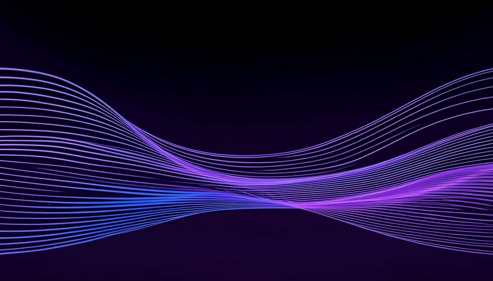
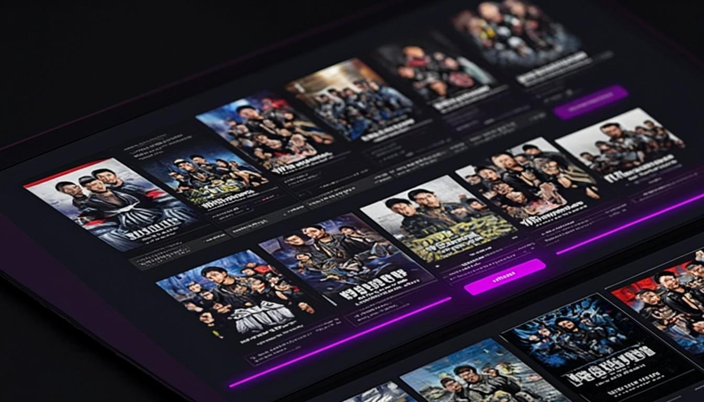

<p align="center">
  
</p>

<h1 align="center">StreamVault</h1>

<p align="center">
  <strong>The premium streaming aggregator.</strong><br/>
  Movies, TV, Anime, Manga, Live TV &amp; Music — unified in one elegant interface.
</p>

<p align="center">
  <a href="https://github.com/Anik1377/NovaTV-Stream/stargazers"></a>
  <a href="https://github.com/Anik1377/NovaTV-Stream/network/members"></a>
  <a href="https://github.com/Anik1377/NovaTV-Stream/blob/main/LICENSE"></a>
  <br/><br/>
  
  
  
  
  
  
</p>

---



---

## ✨ Overview

StreamVault is a **production-grade streaming aggregation platform** that brings together movies, TV shows, anime, manga, live TV channels, music, and casual games into a single, beautifully designed interface. Built with a **Liquid Glass** UI aesthetic, it delivers a premium, app-like experience on every device.

> Think of it as your personal entertainment command center — one search, every source, zero friction.

---

## 🖼️ Preview



---

## 🚀 Features

### 🎬 Content Library

| Feature | Description |
|---|---|
| **Movies & TV** | Full TMDB-powered catalog with trending, popular, top-rated, and discover |
| **Anime** | Dedicated anime section with genre browsing and seasonal content |
| **Manga Reader** | Integrated manga reader with chapter navigation and high-res pages |
| **Live TV** | 1000+ channels from 100+ countries, categorized and searchable |
| **Music** | Search and discover music via integrated streaming |
| **Games** | Casual HTML5 games playable directly in-browser |
| **ShowReels** | Short-form video content curation |

### 🎨 Design & Experience

| Feature | Description |
|---|---|
| **Liquid Glass UI** | Premium glassmorphism design with frosted glass cards and subtle blur effects |
| **Dark Mode Native** | Built dark-first with optional theme switching |
| **Framer Motion** | Smooth page transitions, hover effects, and micro-interactions |
| **Responsive** | Pixel-perfect from mobile to ultrawide |
| **Hover Previews** | Rich movie card previews with trailers on hover |

### 🔐 Security & Auth

| Feature | Description |
|---|---|
| **Supabase Auth** | Secure email/password authentication with session management |
| **Content Security Policy** | Strict CSP headers to prevent XSS and injection attacks |
| **Input Validation** | All API inputs validated and sanitized server-side |
| **Rate-Limited Caches** | Bounded in-memory caches prevent resource exhaustion |
| **Iframe Sandboxing** | All third-party embeds run in restricted sandbox environments |

### 📱 User Features

| Feature | Description |
|---|---|
| **Watch History** | Automatic history tracking (local + cloud sync for logged-in users) |
| **Continue Watching** | Pick up right where you left off from the home page |
| **Watchlist** | Save titles for later with persistent local storage |
| **Profile System** | Customizable profiles with avatars, accent colors, and genre preferences |
| **Social Sharing** | Generate beautiful share cards with OG image support |
| **Multi-Source Player** | Switch between multiple streaming sources seamlessly |

---

## ⚡ Tech Stack

```
┌─────────────────────────────────────────────────┐
│                   Frontend                       │
│  Next.js 16 · React 19 · TypeScript 5.9          │
│  Tailwind CSS 4 · shadcn/ui · Framer Motion 12   │
│  Zustand · TanStack Query · Lucide Icons         │
├─────────────────────────────────────────────────┤
│                   Backend                        │
│  Next.js App Router API Routes · Prisma ORM      │
│  SQLite · Supabase (Auth + Postgres RLS)         │
├─────────────────────────────────────────────────┤
│                  Integrations                     │
│  TMDB API · YouTube Data API v3 · MangaDex       │
│  JioSaavn · IPTV-org · HLS.js                    │
└─────────────────────────────────────────────────┘
```

---

## 🏗️ Architecture

```
src/
├── app/
│   ├── api/              # 40+ API route handlers
│   │   ├── auth/         # Login, register, logout, session
│   │   ├── tmdb/         # Movies, TV, search, discover, people
│   │   ├── manga/        # MangaDex search, detail, chapter, proxy
│   │   ├── youtube/      # Search, trending, related, playlists
│   │   ├── music/        # JioSaavn music search
│   │   ├── profile/      # User profile & watch history CRUD
│   │   └── share/        # OG image generation for social sharing
│   └── page.tsx          # Single-page app entry
├── components/
│   ├── movie/            # VideoPlayer, MovieDetail, TvDetail, SearchResults
│   ├── anime/            # Anime browsing & detail
│   ├── read/             # Manga reader
│   ├── live-tv/          # Live TV channel browser
│   ├── game/             # In-browser game player
│   ├── profile/          # User profile & settings
│   ├── shared/           # ShareModal, common components
│   └── ui/               # shadcn/ui component library
├── store/
│   ├── app-store.ts      # Global app state (routing, watchlist, preferences)
│   └── auth-store.ts     # Authentication state
├── lib/
│   ├── tmdb.ts           # TMDB API client with caching
│   ├── auth.ts           # Session helpers
│   ├── db.ts             # Prisma client (SQLite)
│   ├── watch-history.ts  # LocalStorage watch history
│   └── supabase/         # Supabase SSR client setup
└── middleware.ts          # Security headers, CSP, HSTS, session refresh
```

---

## 🛡️ Security

StreamVault has undergone a **comprehensive penetration test** with 33 vulnerabilities identified and remediated across 25+ files:

- ✅ Content Security Policy with strict allowlists
- ✅ Strict-Transport-Security (HSTS) with includeSubDomains
- ✅ All API inputs validated and type-checked
- ✅ Real JWT-based authentication (no fake auth checks)
- ✅ Iframe sandboxing on all third-party embeds
- ✅ Bounded caches to prevent memory exhaustion
- ✅ Sanitized error responses (no internal detail leakage)
- ✅ SQLi-safe via Prisma parameterized queries
- ✅ CORS configured with explicit origin allowlist
- ✅ CSRF protection on state-changing endpoints

---

## 📦 Getting Started

### Prerequisites

- Node.js 18+ or Bun 1.0+
- A [TMDB API key](https://www.themoviedb.org/settings/api)
- (Optional) A [Supabase](https://supabase.com) project for authentication

### Installation

```bash
# Clone the repository
git clone https://github.com/Anik1377/NovaTV-Stream.git
cd NovaTV-Stream

# Install dependencies
bun install

# Set up environment variables
cp .env.example .env
# Edit .env with your API keys

# Push database schema
bun run db:push

# Start development server
bun run dev
```

### Environment Variables

| Variable | Required | Description |
|---|---|---|
| `DATABASE_URL` | ✅ | SQLite database path (e.g., `file:./db/custom.db`) |
| `TMDB_API_KEY` | ✅ | [TMDB](https://themoviedb.org) API key |
| `YOUTUBE_API_KEY` | ⬜ | YouTube Data API v3 key (for trailers & music) |
| `NEXT_PUBLIC_SUPABASE_URL` | ⬜ | Supabase project URL |
| `NEXT_PUBLIC_SUPABASE_PUBLISHABLE_KEY` | ⬜ | Supabase anon/public key |

---

## 🌐 Deployment

StreamVault is optimized for **Vercel** with `output: "standalone"`:

```bash
# Deploy to Vercel
vercel --prod
```

Also compatible with any Node.js hosting platform (Docker, Railway, Fly.io, etc.).

---

## 📊 Stats

<p align="center">
  
  
  
  
</p>

---

## 🤝 Contributing

Contributions are welcome! Please follow these steps:

1. Fork the repository
2. Create your feature branch (`git checkout -b feature/amazing-feature`)
3. Commit your changes (`git commit -m 'Add amazing feature'`)
4. Push to the branch (`git push origin feature/amazing-feature`)
5. Open a Pull Request

---

## 📄 License

This project is licensed under the MIT License — see the [LICENSE](LICENSE) file for details.

---

<p align="center">
  Built with ❤️ by <a href="https://github.com/Anik1377">Anik1377</a>
  <br/>
  <sub>StreamVault — Your entertainment, unified.</sub>
</p>
